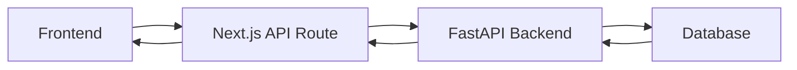

# FastAPI Backend Integration Guide

## 🔗 **Overview**

Your frontend now communicates with the Python FastAPI backend instead of using mock data. The Next.js API routes act as proxies to forward requests to the FastAPI server.

## ⚙️ **Configuration**

### 1. **Environment Variables**

Create or update your `.env.local` file in the `frontend` directory:

```env
# Backend API Configuration
BACKEND_API_URL=http://localhost:8000

# Optional: Database configuration (if needed)
DB_TYPE=postgresql
DB_HOST=localhost
DB_PORT=5432
DB_NAME=docker_management
DB_USER=postgres
DB_PASSWORD=your_password_here
```

### 2. **Backend Server Setup**

Your backend team should run their FastAPI server on `http://localhost:8000` (or update the `BACKEND_API_URL` accordingly).

## 🛣️ **API Endpoints Mapping**

| Frontend Route                         | Backend Route                      | Method | Purpose             |
| -------------------------------------- | ---------------------------------- | ------ | ------------------- |
| `/api/auth/signin`                     | `/auth/signin`                     | POST   | User login          |
| `/api/auth/signup`                     | `/auth/signup`                     | POST   | User registration   |
| `/api/auth/me`                         | `/auth/me`                         | GET    | Get current user    |
| `/api/docker/upload`                   | `/docker/upload`                   | POST   | Upload Docker image |
| `/api/docker/images`                   | `/docker/images`                   | GET    | Get all images      |
| `/api/docker/images/{id}/restrictions` | `/docker/images/{id}/restrictions` | PUT    | Update restrictions |

## 🔄 **Request Flow**



## 📋 **Expected FastAPI Endpoints**

Your backend team should implement these endpoints:

### **Authentication**

```python
# POST /auth/signin
{
  "email": "string",
  "password": "string"
}
# Response: {"token": "string", "user": {...}}

# POST /auth/signup
{
  "firstName": "string",
  "lastName": "string",
  "email": "string",
  "password": "string"
}
# Response: {"success": true, "message": "string"}

# GET /auth/me
# Headers: Authorization: Bearer <token>
# Response: {"email": "string", "name": "string"}
```

### **Docker Management**

```python
# POST /docker/upload
# Headers: Authorization: Bearer <token>
# Body: FormData with image file and metadata
# Response: {"success": true, "imageId": "string", "status": "string"}

# GET /docker/images
# Headers: Authorization: Bearer <token>
# Response: {"images": [...]}

# PUT /docker/images/{id}/restrictions
# Headers: Authorization: Bearer <token>
# Body: {"itemRestrictions": number}
# Response: {"success": true, "message": "string"}
```

## 🚀 **Testing the Integration**

### 1. **Start the Backend Server**

Your backend team should start their FastAPI server:

```bash
# In the backend directory
uvicorn main:app --reload --host 0.0.0.0 --port 8000
```

### 2. **Start the Frontend**

```bash
# In the frontend directory
npm run dev
```

### 3. **Test Authentication**

- Go to `http://localhost:3000/signin`
- Try logging in with credentials provided by your backend team
- Check browser console for any errors

### 4. **Test Docker Upload**

- Sign in as admin
- Go to upload page
- Try uploading a Docker image
- Check if it appears in the dashboard

## 🐛 **Troubleshooting**

### **Common Issues:**

1. **CORS Errors**

   - Backend needs to allow requests from `http://localhost:3000`
   - Add CORS middleware to FastAPI

2. **Connection Refused**

   - Ensure FastAPI server is running on port 8000
   - Check `BACKEND_API_URL` in `.env.local`

3. **Authentication Errors**

   - Verify token format matches backend expectations
   - Check if backend validates tokens correctly

4. **File Upload Issues**
   - Ensure backend accepts multipart/form-data
   - Check file size limits

### **Debug Steps:**

1. **Check Network Tab**

   - Open browser DevTools
   - Go to Network tab
   - Look for failed requests to backend

2. **Check Console Logs**

   - Look for JavaScript errors
   - Check for API response errors

3. **Test Backend Directly**
   - Use tools like Postman or curl
   - Test backend endpoints directly

## 🔧 **Backend Team Requirements**

Your backend team should provide:

1. **API Documentation** with exact endpoint specifications
2. **Authentication method** (JWT, session, etc.)
3. **Expected request/response formats**
4. **Error handling** and status codes
5. **CORS configuration** for frontend domain
6. **File upload handling** for Docker images

## 📞 **Communication**

Coordinate with your backend team on:

- **API versioning** strategy
- **Error handling** conventions
- **Authentication** flow
- **Data validation** rules
- **Testing** procedures

Your frontend is now ready to integrate with the FastAPI backend! 🎉
